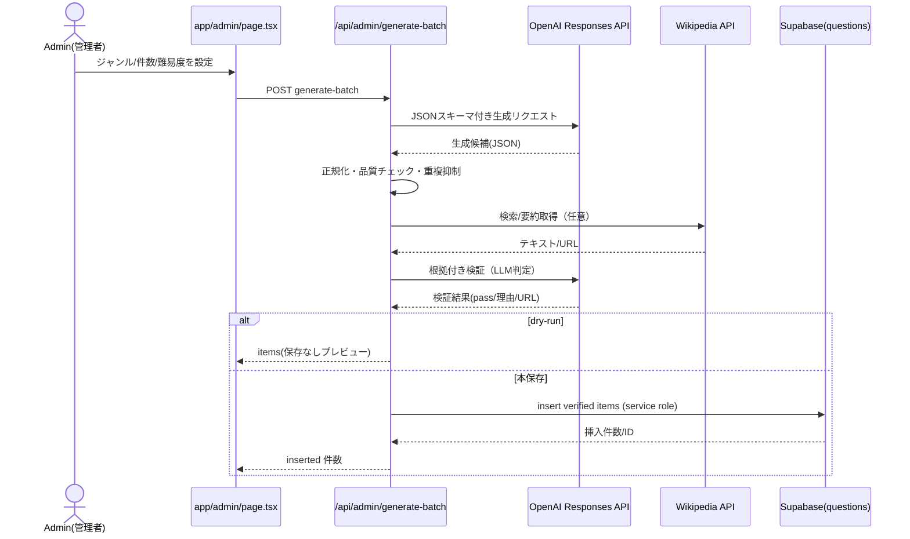

# 問題を生成してDBに登録するまでの流れ

本ドキュメントは、管理画面からの問題生成/手動登録がどのように実行され、どのAPI・ロジックを経由して Supabase の `public.questions` に保存されるかを、実装位置と共にまとめたものです。最後にシーケンス図も記載します。

## 概要
- 生成系の入口: `app/admin/page.tsx` から管理者が操作
- 保存API: `app/api/admin/questions/route.ts`（手動入力の一括保存）
- バッチ生成API: `app/api/admin/generate-batch/route.ts`（OpenAIで生成→品質チェック→検証→保存）
- DBクライアント: `lib/supabase.ts`（anon と service role を使い分け）
- テーブル定義: `supabase/schema.sql`（`public.questions` ほか）

## 必要な環境変数
- `SUPABASE_URL`, `SUPABASE_ANON_KEY`（参照用）
- `SUPABASE_SERVICE_ROLE_KEY`（管理系の書き込み用）
- `OPENAI_API_KEY` または `API_KEY`（OpenAI Responses API 呼び出し）
- 任意: `ADMIN_TOKEN`（管理APIの簡易認可用、`x-admin-token` と一致で許可）

## データモデル（保存先）
- テーブル: `public.questions`（`supabase/schema.sql:1`）
  - 主な列: `prompt`(問題文), `choices`(JSONB, 4択), `answer_index`(0..3), `explanation`, `category`, `subgenre`, `difficulty`(easy/normal/hard), `source`, `hash`, `verified`, `verified_at`, `verify_notes`, `source_url`, `created_at`
  - ハッシュ重複対策: 文章と選択肢から `hash` をトリガで自動算出（`supabase/schema.sql:74` 以降）。`uq_questions_hash` で重複を抑止可能。

## 手動入力→保存のフロー（管理画面で作成した問題を登録）
1) 管理画面で入力・整形
- UI: `app/admin/page.tsx`（例: `addItem`, `saveAll`）
- 入力値スキーマ: `QuestionSchema`（`app/admin/page.tsx:76`）

2) 保存API呼び出し
- エンドポイント: `POST /api/admin/questions`
- 実装: `app/api/admin/questions/route.ts`
- 認可: `ADMIN_TOKEN` が設定されている場合、ヘッダ `x-admin-token` が一致した時のみ許可（`app/api/admin/questions/route.ts:24`）

3) DB保存
- `serverSupabaseService()` で service role クライアント生成（`lib/supabase.ts:11`）
- 受信データをDBのカラムへマッピングして `insert`（`app/api/admin/questions/route.ts:74`）
- `id` はDB側の identity に任せる（`BIGINT GENERATED ALWAYS AS IDENTITY`）
- 戻り値: 追加件数など（`app/api/admin/questions/route.ts:98`）

## バッチ生成→検証→保存のフロー（OpenAIで自動生成して登録）
1) 生成パラメータの入力
- UI: `app/admin/page.tsx` 内の「ジャンル指定でGPT生成」セクション
- ユーザー操作により、`/api/admin/generate-batch` を `POST`（`app/admin/page.tsx:259` 付近）

2) OpenAI への生成要求
- 実装: `app/api/admin/generate-batch/route.ts`
- モデル: `gpt-5-nano`
- API: `https://api.openai.com/v1/responses`
- JSONスキーマを `text.format` で与え、配列（items）のみを返すよう誘導（`route.ts:120` 付近）
- 応答の取り出しは堅牢化（content:json, content:text, output_text など複数経路をケア、`parseFromAny` 参照）
- 必要に応じて再試行や不足分の追加生成を実行（`route.ts:216` 以降）

3) 正規化と品質チェック
- 入力揺れに対応（`question`/`prompt`, `choices`/`options`, `answerIndex`/`correctIndex`/文字ラベル などの正規化、`route.ts:263` 以降）
- 日本語自然性、禁止句（「以上すべて」等）チェック、選択肢の重複除去、長すぎる選択肢の除外（`route.ts:297` 以降）
- バッチ内・DB既存との類似度による重複抑制（bi-gram DICE係数と選択肢オーバーラップ、`route.ts:362` 以降）

4) 検証（ファクトチェック）
- 優先: Wikipedia サマリの自動取得→LLMで根拠付き判定（`verifyWithSources`、`route.ts:430` 以降）
- フォールバック: LLM自己検証（`verifyQuestion`、`route.ts:486` 以降）
- 結果 `pass: true` のみ「verified=true」で採用（`route.ts:538` 付近）

5) 保存（dry-run 可）
- クエリ `?dry=1` でプレビューのみ応答（保存なし、`route.ts:552`）
- 保存時は `serverSupabaseService()` で `questions` に `insert`（`route.ts:575` 以降）
- トリガにより `hash` 自動算出。DBユニーク制約により重複混入を抑制可（必要に応じて有効化）

6) 応答
- `inserted` 件数・発行ID等を返却（`route.ts:603`）

## 補助API（検証単体/カテゴリ管理/取得）
- `POST /api/admin/validate-question`: 単体または複数のアイテムを検証（Wikipedia→LLM、`app/api/admin/validate-question/route.ts`）
- `POST /api/admin/categories`: カテゴリの追加（`app/api/admin/categories/route.ts`）
- `GET /api/admin/questions`: 直近の問題を参照（`app/api/admin/questions/route.ts:104`）

## 参照用（出題側API）
- `POST /api/generate-questions`: DBから指定条件で問題を抽出して返すのみ（生成はしない、`app/api/generate-questions/route.ts`）

## シーケンス図（バッチ生成→保存）

## トラブルシューティングのヒント
- OpenAIキー未設定: 500 「Missing OpenAI API key」
- 認可エラー: 401 「Unauthorized」→ `ADMIN_TOKEN` と `x-admin-token` を確認
- 生成が空/解析失敗: 422/生成ロジックの再試行分岐と `DEBUG_GENERATION` を活用
- 重複：DBの `uq_questions_hash` を活用。生成側の類似度しきい値（`DUP_THRESHOLD` 等）の調整も有効

## 実装位置（抜粋・ファイル参照）
- 管理UI: `app/admin/page.tsx:235`
- 手動保存API: `app/api/admin/questions/route.ts:63`
- バッチ生成API: `app/api/admin/generate-batch/route.ts:98`
- 検証API: `app/api/admin/validate-question/route.ts:1`
- Supabaseクライアント: `lib/supabase.ts:1`
- スキーマ/トリガ: `supabase/schema.sql:1`, `supabase/schema.sql:74`

---
本書の内容で不足や修正希望があればお知らせください。カテゴリーや難易度のエイリアス正規化、重複しきい値、検証戦略は用途に応じて調整可能です。
